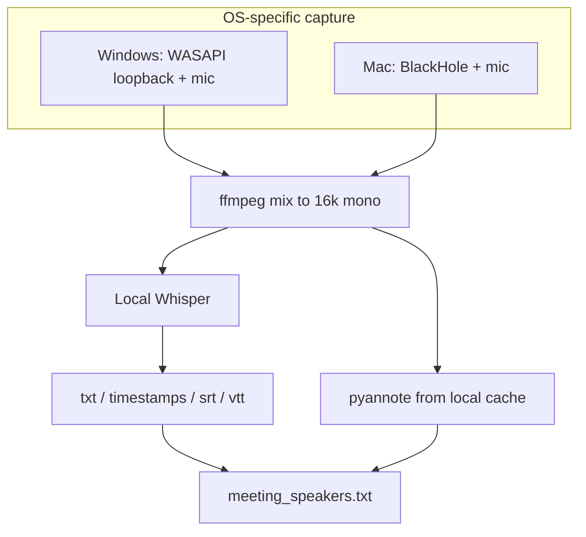

# Cross-platform, fully local voice-to-subtitles

**Overview:** Make the meeting recorder work on both Mac and Windows (mic + system audio), avoid needing an HF token at everyday runtime (one-time model download OK), and add setup scripts — prioritized from blockers to polish.

## Todos

- [x] OS-specific mic+system capture (Mac BlackHole, Windows WASAPI) + device CLI
- [x] Add `setup_mac.sh` and `setup_windows.ps1` with deps + device checks (print BlackHole steps; no GUI automation)
- [x] Keep pyannote; one-time HF download → local model cache; no token required at runtime
- [x] Better segment alignment, stream-to-disk recording, CLI for language/model (default language `ru`)
- [x] Add deps with `uv add` (pyproject.toml + uv.lock), unify entrypoint, device dry-run

## Decisions locked

- **Capture:** mic + system audio on both platforms (not mic-only).
- **Dual platform:** Windows WASAPI loopback first-class; Mac uses BlackHole. One shared pipeline, OS-specific input layer.
- **Packaging:** **uv** only — `uv add` / `uv sync`; [`pyproject.toml`](../pyproject.toml) + `uv.lock` are source of truth.
- **Diarization:** keep **pyannote**; allow **one-time** gated HF download (token/login once), then load from **local cache/path forever** with no `HF_TOKEN` in normal runs.
- **Setup:** shell/PowerShell scripts install packages + **verify/print** BlackHole / Multi-Output steps. No Audio MIDI Setup GUI automation.
- **Language:** default stays **`ru`**; optional CLI override for language/model is fine.

## Target architecture

## Priority 1 — Unblock Mac + keep Windows (recording layer)

**Files:** [`src/voice_to_subtitles.py`](../src/voice_to_subtitles.py)

- Replace hard Windows-only `pyaudiowpatch` import with a small audio backend abstraction:
  - **Windows:** WASAPI loopback for system + default/selected mic (`sounddevice` preferred; fall back to `pyaudiowpatch` only if needed).
  - **macOS:** two input streams — physical mic + BlackHole (or similarly named virtual device).
- Remove hardcoded `MIC_DEVICE` / `SYSTEM_DEVICE` indexes; add:
  - `--list-devices`
  - `--mic` / `--system` by index or name substring
  - sensible auto-detect (e.g. name contains `BlackHole` on Mac; loopback device on Windows)
- Read channels/sample rate from the chosen device instead of fixed 44100/48000 assumptions where possible.
- Resolve diarization via direct in-process call (`diarizer.diarize.run_diarization_files`) in the same uv env — no second venv / no subprocess for diarize.

## Priority 2 — Setup / install scripts

**New:** `scripts/setup_mac.sh`, `scripts/setup_windows.ps1`

**Mac script:**

- Require `uv` on PATH (fail with install hint if missing)
- Ensure Homebrew deps: `ffmpeg`; print BlackHole install + Multi-Output checklist
- Run `uv sync`
- Verify BlackHole is visible to the audio library; print exact manual steps if not
- Optionally open Audio MIDI Setup (open app only — no UI automation)
- Optional one-shot: `download-models` / env `HF_TOKEN` to prefetch pyannote into local cache

**Windows script:**

- Require `uv` on PATH
- Ensure `ffmpeg` on PATH
- Run `uv sync`; verify WASAPI loopback device is enumerable
- Same optional model prefetch step
- No BlackHole

Both scripts idempotent; fail with clear next steps. Add packages with `uv add <pkg>` during implementation.

## Priority 3 — Diarization: one-time HF, then local forever

**Files:** [`src/diarize.py`](../src/diarize.py), deps in [`pyproject.toml`](../pyproject.toml)

- Keep **pyannote** (`speaker-diarization-community-1` or current model).
- **Setup / first fetch:** accept HF token or `huggingface-cli login` once; download weights into a known local dir (e.g. project `models/` or HF cache path we pin).
- **Runtime:** `Pipeline.from_pretrained(local_path)` (or equivalent) with **no** required `HF_TOKEN` env var for normal meetings.
- If local model missing, fail with a clear message: run setup/download step (do not silently demand token mid-meeting).
- Keep CLI contract: `diarize.py meeting.wav meeting_timestamps.txt meeting_speakers.txt`.
- Prefer **one uv-managed env** (`uv sync` / `uv run`) for record+whisper+diarize.

## Priority 4 — Pipeline correctness / robustness

- Align speakers using Whisper segment `[start, end]` floats instead of second-only timestamps + `end = start + 5` heuristics.
- Stream WAV to disk during recording (avoid holding whole meeting in RAM).
- Pre-cache Whisper weights / document offline cache; keep `fp16=False` on CPU.
- Default **`LANGUAGE=ru`**; add CLI flags for `--language` / `--whisper-model`.

## Priority 5 — Project hygiene

- Declare runtime deps via **`uv add`** (`sounddevice` and/or platform extras, `openai-whisper`, `torch`, `pyannote.audio`, etc.).
- Prefer `uv run …` from setup scripts.
- Unify entrypoint (`[project.scripts]` or `python -m`).
- Device dry-run: `--list-devices` and exit.

## Explicit non-goals (this pass)

- Replacing pyannote with a weaker embedding+clustering stack (deferred; one-time HF is accepted)
- Fully unattended BlackHole Multi-Output creation / Audio MIDI GUI automation
- Cloud ASR or any online API at meeting time

## Implementation order

1. Audio abstraction + device CLI (Mac BlackHole + Windows loopback)
2. Setup scripts (`uv sync`, device checks, printed BlackHole steps, optional model download)
3. Pyannote local-cache load path (token only for one-time download)
4. Timestamp alignment + stream-to-disk
5. Deps / entrypoint cleanup via `uv add`
